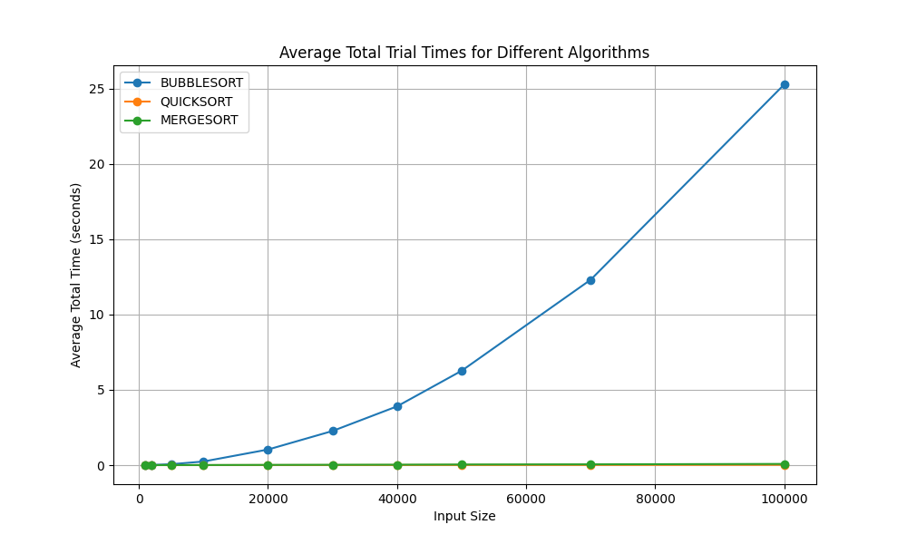
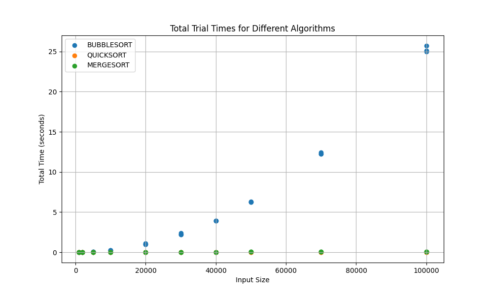
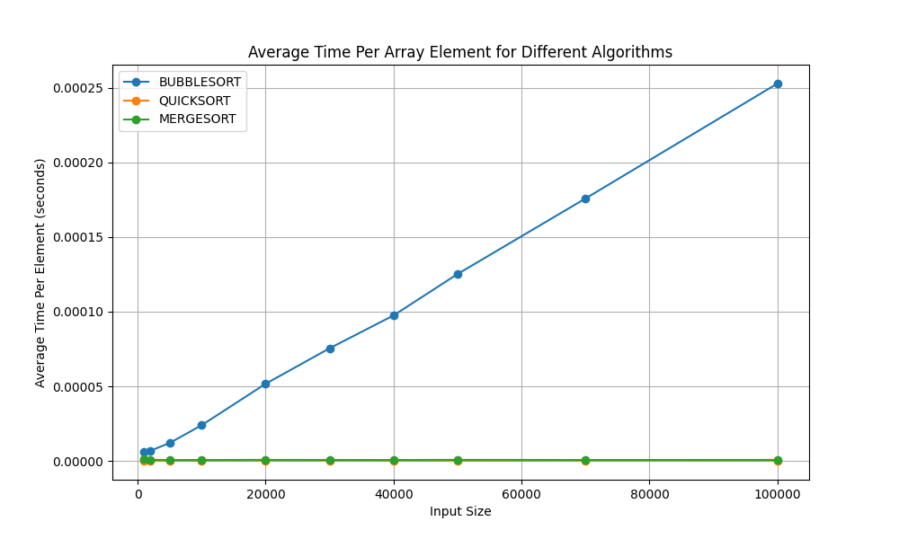
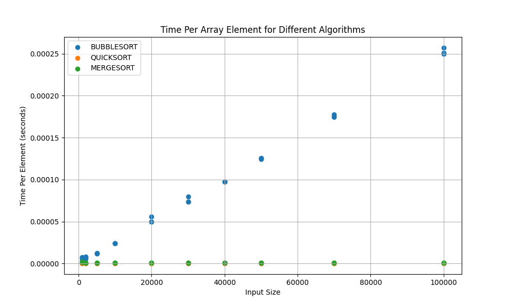

# Analyzing Sorting Algorithms

C++ Program to run and process relevant data while testing the algorithms, and Python for graphing the data. The data is generated in `data/Benchmarks_Sorts.csv`.

## Usage
Compile and run the C++ program using the C++17 (or later) standard.
```bash
g++ -std=c++17 benchmark_sorts.cc -o benchmark_sorts
./benchmark_sorts
```
## Plots
To generate the plots, run the python file `plot.py`, with the required dependencies.
1. Install numpy, pandas, and matplotlib.
```bash
pip install numpy pandas matplotlib
```

Alternatively, use the `requirements.txt` file and install to your virtual environment.
```bash
pip install -r requirements.txt
```

2. Run `plot.py`
```bash
python plot.py
```

## Screenshots
### Total Time Plots
 


### Time Per Element Plots
 

